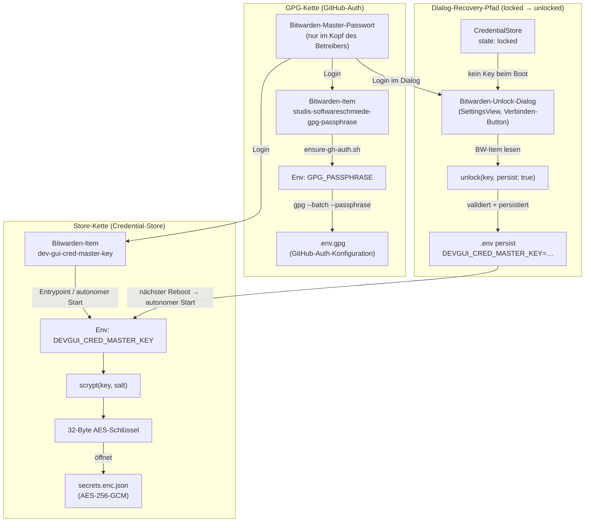

# Credential Key Flow — Referenzdokument

> **Zweck:** Ein durables Referenzdokument für die zwei getrennten Geheimnisse (GPG-Passphrase vs. Store-Master-Key), ihre Bezugsmodi (autonom/interaktiv), die Prioritätskette und die Datei-/Item-Topologie. Ersetzt verstreute Hinweise in ADR-007/ADR-014/Entrypoint; Single Source of Truth nach der Entkopplung ([[credential-master-key-decoupling]]).
>
> **Sicherheits-Floor:** Dieses Dokument enthält ausschliesslich Namen, Bezeichner und Flussbeschreibungen — keine echten Geheimnis-Werte.

---

## 1. Geheimnisse (Tabelle)

| Geheimnis | Was | Wo gespeichert | Rolle |
|---|---|---|---|
| Bitwarden-Master-Passwort | Zugangsdaten zum Bitwarden-Konto des Betreibers | Nur im Kopf des Betreibers (kein Digitalspeicher in dev-gui) | Öffnet das Bitwarden-Konto; Voraussetzung für jeden der beiden unten stehenden Bezugswege |
| Bitwarden-Item `studis-softwareschmiede-gpg-passphrase` | GPG-Passphrase zum Entschlüsseln von `.env.gpg` | Bitwarden-Konto des Betreibers (separates Item) | Einzige Quelle von `GPG_PASSPHRASE`; öffnet ausschliesslich `.env.gpg` / GitHub-Auth |
| `GPG_PASSPHRASE` | Laufzeit-Env-Var (Container) | Aus Bitwarden abgeleitet, per Entrypoint (`ensure-gh-auth.sh`) gesetzt | Entschlüsselt `.env.gpg`; fließt **nicht** in den Credential-Store |
| Bitwarden-Item `dev-gui-cred-master-key` | Master-Key für den verschlüsselten Credential-Store | Bitwarden-Konto des Betreibers (getrenntes Item) | Einzige Quelle von `DEVGUI_CRED_MASTER_KEY`; öffnet ausschliesslich `secrets.enc.json` |
| `DEVGUI_CRED_MASTER_KEY` | Laufzeit-Env-Var (Container) | Aus Bitwarden abgeleitet; im autonomen Modus via `.env` persistiert | Kanonischer Master-Key des `CredentialStore` (ADR-007); scrypt → AES-Key → `secrets.enc.json` |

---

## 2. Dateien (Tabelle)

| Datei | Inhalt | Womit entschlüsselt/geöffnet | Speicherort |
|---|---|---|---|
| `.env.gpg` | GitHub-Auth-Konfiguration, App-Credentials (GPG-verschlüsselt) | `GPG_PASSPHRASE` via `gpg --batch --passphrase` | Plugin-Tree im Persistent-Volume (`$HOME/.claude/plugins/cache/agent-flow/…`) |
| `secrets.enc.json` | Verschlüsselter Credential-Store (Integration-Credentials, SSH-Keys, Metadaten) | `DEVGUI_CRED_MASTER_KEY` → scrypt → 32-Byte-AES-256-GCM-Schlüssel | Persistent-Volume `$HOME/.claude/dev-gui/secrets.enc.json` (mode `0600`) |
| `.env` | Betreiber-Konfiguration im Klartext (enthält u.a. `DEVGUI_CRED_MASTER_KEY` nach dem ersten Unlock) | Kein Verschlüsselung; geschützt durch Dateisystem-Berechtigungen (mode `0600`) und Volume-Isolation | Persistent-Volume `$HOME/.claude/dev-gui/.env` (oder konfigurierter `CRED_ENV_PATH`) |

---

## 3. Ablauf

### 3a. Autonom (Normalbetrieb / Bootstrap)

1. Entrypoint (`docker-entrypoint.sh`) startet.
2. `ensure-gh-auth.sh` entschlüsselt `.env.gpg` mit `GPG_PASSPHRASE` → GitHub-Auth persistent eingerichtet; `GH_TOKEN`/`GITHUB_TOKEN` danach unset.
3. `DEVGUI_CRED_MASTER_KEY` (oder `DEVGUI_CRED_MASTER_KEY_FILE`) ist im Container-Env oder `.env` vorhanden (wurde beim letzten Unlock persistiert).
4. `CredentialStore` lädt den Key beim Start → `state: unlocked`, `keySource: "auto"`.
5. Nacht-Jobs (`ReconciliationJob`, ADR-013) laufen ohne Interaktion.

### 3b. Interaktiv / Recovery (erster Setup oder Schlüssel-Verlust)

1. Entrypoint startet ohne `DEVGUI_CRED_MASTER_KEY`; kein verschlüsselter Eintrag im Store → kein Fail-Fast.
2. `CredentialStore` → `state: locked`, `keySource: "none"`.
3. SettingsView zeigt Statuszeile „gesperrt" + Verbinden-Button (über `GET /api/settings/credential-status`).
4. Betreiber klickt „Verbinden" → **Bitwarden-Unlock-Dialog** öffnet sich.
5. Betreiber gibt E-Mail, Master-Passwort (+ optional 2FA) ein → serverseitige Bitwarden-Boundary liest Item `dev-gui-cred-master-key`.
6. Key verlässt die Boundary nur store-intern an `unlock(key, { persist: true })`.
7. `unlock(...)` validiert den Key, persistiert `DEVGUI_CRED_MASTER_KEY=<wert>` atomar in `.env` (mode `0600`), setzt `state: unlocked`, `keySource: "manual"`.
8. Nächster Reboot: `.env` enthält den Key → autonomer Start (Pfad 3a).

---

## 4. Mermaid-Diagramm: Geheimnis-Ketten und Recovery-Pfad

---

## 5. Prioritätskette (Store-Master-Key)

Die folgende Kette ist **bindend** und identisch zu [[credential-master-key-decoupling]] §2:

> `explizit gesetzter Key / .env (DEVGUI_CRED_MASTER_KEY)` **>** `DEVGUI_CRED_MASTER_KEY_FILE` **>** `deprecated CRED_MASTER_KEY` (Übergangs-Fallback, Warn-Log) **>** `deprecated CRED_MASTER_KEY_FILE` (Warn-Log) **>** Dialog-Recovery (locked). **Kein** Wert aus `GPG_PASSPHRASE` oder `gpg.pass` fließt mehr in den Store-Key.

Bedeutung der Stufen:

| Priorität | Quelle | Hinweis |
|---|---|---|
| 1 (höchste) | `DEVGUI_CRED_MASTER_KEY` (Env oder `.env`) | Kanonischer Name; direkter Roh-Key |
| 2 | `DEVGUI_CRED_MASTER_KEY_FILE` | Pfad zu einer Datei, deren Inhalt der Key ist |
| 3 | `CRED_MASTER_KEY` (deprecated) | Übergangs-Fallback; Warn-Log (Wert nie im Log) |
| 4 | `CRED_MASTER_KEY_FILE` (deprecated) | Übergangs-Fallback; Warn-Log (Wert nie im Log) |
| 5 (niedrigste) | Kein Key gefunden | `CredentialStore` startet im Zustand `locked`; Dialog-Recovery möglich |

**`keySource`-Werte** (aus [[credential-key-status-transparency]]):

| Wert | Bedeutung |
|---|---|
| `"auto"` | Key beim Boot aus Env/`.env` geladen (Priorität 1–4) |
| `"manual"` | Key zur Laufzeit per `unlock(...)` via Bitwarden-Dialog geladen |
| `"none"` | Kein Key geladen; `state: "locked"` |

---

## 6. Entkopplung: `GPG_PASSPHRASE` vs. `DEVGUI_CRED_MASTER_KEY`

### Was jedes Geheimnis öffnet

| Geheimnis | Öffnet | Öffnet NICHT |
|---|---|---|
| `GPG_PASSPHRASE` | `.env.gpg` (GitHub-Auth-Konfiguration) | `secrets.enc.json` (Credential-Store) |
| `DEVGUI_CRED_MASTER_KEY` | `secrets.enc.json` (Credential-Store via scrypt + AES-256-GCM) | `.env.gpg` |

### Warum getrennt?

Die Trennung ist bewusst und wurde mit [[credential-master-key-decoupling]] etabliert:

1. **Verschiedene Schutzgüter:** `GPG_PASSPHRASE` öffnet die statisch beim Deploy verschlüsselte GitHub-Auth-Datei. `DEVGUI_CRED_MASTER_KEY` öffnet den zur Laufzeit beschreibbaren, AES-verschlüsselten Store — ein anderer Modus, ein anderer Lifecycle.
2. **Unabhängige Rotation:** Der Store-Master-Key kann rotiert werden ([[credential-key-rotation]]) ohne die GPG-Passphrase zu berühren und umgekehrt.
3. **Kein impliziter Unlock:** Früher fiel der Entrypoint bei fehlendem `CRED_MASTER_KEY` auf `GPG_PASSPHRASE` zurück, sodass dev-gui faktisch immer „unlocked" startete und der Unlock-Dialog ([[credential-unlock-dialog]]) nie erschien. Dieser Fallback ist **entfernt**.
4. **Bitwarden-Item-Trennung:** Zwei getrennte Bitwarden-Items (`studis-softwareschmiede-gpg-passphrase` vs. `dev-gui-cred-master-key`) ermöglichen selektive Berechtigungen und eine klare Verantwortungstrennung.

### Wegfall des alten GPG→Store-Fallbacks

Der bisherige Entrypoint-Block, der bei fehlendem `CRED_MASTER_KEY(_FILE)` auf `GPG_PASSPHRASE` bzw. die gemountete `gpg.pass` zurückfiel, wurde **entfernt** (umgesetzt in [[credential-master-key-decoupling]] AC4). `GPG_PASSPHRASE` fließt **unter keinen Umständen** in den Store-Key; ist kein dedizierter Store-Key gesetzt, bleibt der Store locked (kein impliziter Unlock über die GPG-Passphrase).

---

*Verweis: Tiefe Architektur-Entscheidungen in [`docs/architecture.md`](../architecture.md) ADR-007 (Store-Krypto) und ADR-014 (Runtime-Unlock + Entkopplung).*
